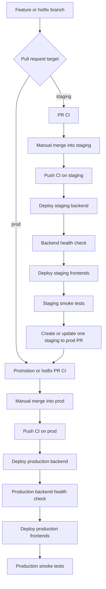

# CICG Branch Promotion and CI/CD Design

**Date:** 2026-08-10
**Status:** Approved for specification review
**Scope:** The-Team-CG product repositories and the central reusable-workflow repository

## Goal

Use a predictable two-environment delivery flow across the CICG product repositories:

- `staging` is the integration and pre-production branch.
- `prod` is the protected production branch.
- Staging deploys automatically after successful CI and smoke checks.
- A single continuously updated `staging` to `prod` pull request is created after staging is healthy.
- Production deployment starts only after that pull request is manually merged and the resulting `prod` commit passes CI.
- SonarCloud is removed because the private repositories would require a paid plan.

The central `.github` repository remains on its own `main` branch. Its branch is the reusable workflow library branch, not a product deployment environment.

## Approved decisions

1. Keep `staging`; rename the current product `main` branch to `prod`.
2. Keep one reusable `staging` to `prod` promotion pull request instead of opening a new pull request for every staging push.
3. Deploy staging automatically after green CI.
4. Open or update the promotion pull request only after staging deployment and smoke checks pass.
5. Use the manual merge into `prod` as the production approval gate; deployment proceeds automatically after successful `prod` CI.
6. Run full CI on pull requests and pushes to both `staging` and `prod`.
7. Use merge commits for the long-lived `staging` to `prod` promotion; do not squash that promotion.
8. Treat missing deployment credentials or deployment identifiers as deployment failures, not successful skips.
9. Keep dependency audit, lint, typecheck, tests, coverage, build, and Gitleaks as required gates. Keep CodeQL advisory while Advanced Security is unavailable or unaffordable.
10. Keep the practical coverage floor at 50% lines/statements/functions and 40% branches where the repository has coverage enforcement.
11. Deploy backends before dependent frontends, and require backend health before frontend deployment.
12. Run explicit forward-only database migrations where a product owns migrations; never reset or seed production during deployment.
13. Permit `hotfix/*` pull requests directly to `prod`, then back-merge the production fix into `staging`.
14. Pin product callers to an immutable central workflow release tag, such as `@v2`, after implementation. Do not keep production callers on mutable `@main`.
15. Use manual rollback to a previously successful commit or image digest.
16. Keep release tagging manual from `prod`; notifications remain optional and must not gate delivery.

## Branch model

### Product repositories

| Branch | Purpose | Allowed entry | Deployment |
|---|---|---|---|
| `staging` | Integration and pre-production | Feature PRs, approved by repository policy | Automatic staging deployment after CI and smoke checks |
| `prod` | Production | Promotion PR from `staging` or approved `hotfix/*` PR | Automatic production deployment after merged-commit CI |

Both branches are intended to be protected. On GitHub plans that support private-repository branch protection, direct pushes are disabled and pull requests require the configured approvals and required checks. The current organization is on GitHub Free, which rejects branch protection, rulesets, and required environment reviewers for these private repositories. Until that plan limitation is removed, the reusable production deployment workflows enforce the deployment invariant by accepting only an exact SHA that is the merge commit of a `staging` or approved `hotfix/*` pull request into `prod`. `staging` remains the default branch for normal development; `prod` is the production branch.

The deployment guard is implemented once as `.github/actions/validate-prod-promotion` and used by both central Render and Vercel deploy workflows. It applies only to `production`, so staging remains automatic. Manual rollback to a previously merged production SHA remains valid because that SHA is associated with its original merged promotion PR.

### Central workflow repository

`The-Team-CG/.github` keeps `main` as its default development branch. Product repositories consume a tagged release of the reusable workflows, for example:

```yaml
uses: The-Team-CG/.github/.github/workflows/ci-node.yml@v2
```

The central repository is not renamed to `prod`; changing its branch would unnecessarily break workflow references and confuse workflow-library versioning with application deployment state.

## End-to-end flow



The staging-to-production pull request is updated automatically when new commits land on `staging`. Its required checks rerun for the current merge result. A merge is never treated as a deployment authorization until the resulting `prod` push also passes `prod` CI.

The promotion pull request also has a required `staging-promotion` readiness check tied to the current `staging` head SHA. The check is successful only after that exact SHA has passed staging deployment and smoke checks. If a newer staging commit has not deployed or has failed smoke checks, the pull request remains blocked even if its ordinary code CI passes.

## Product workflow responsibilities

Each product repository keeps thin caller workflows. The central repository owns reusable implementation; product callers provide paths, commands, project identifiers, environment names, and product-specific service ordering.

### `ci.yml`

Triggers:

- `pull_request` targeting `staging` or `prod`.
- `push` to `staging` or `prod`.

Required validation jobs:

1. Install dependencies using the repository lockfile.
2. Run the dependency audit. Node repositories use `npm audit --audit-level=high`; Python packages use `pip-audit` after installation.
3. Run lint when the product provides it.
4. Run typecheck when the product provides it.
5. Run the product's real test suite and coverage command.
6. Upload coverage artifacts when produced.
7. Run the production-equivalent build.
8. Run current-tree Gitleaks with redacted output; findings fail CI.
9. Run CodeQL as an advisory security job when repository plan capabilities allow it; unavailable Advanced Security must be reported explicitly.

Sonar jobs and Sonar configuration are not part of CI.

### `deploy.yml`

The deployment caller is triggered from the successful `CI` workflow and deploys the exact `workflow_run.head_sha`. It accepts only `staging` and `prod` as deployment branches.

For products with a backend:

1. Build the backend image for `linux/amd64`.
2. Tag it with the tested commit SHA and publish it to GHCR.
3. Scan the image with Trivy for HIGH and CRITICAL OS/library vulnerabilities.
4. Run the explicit migration step when the product owns migrations.
5. Trigger the environment-specific Render deployment using the immutable image digest.
6. Poll the backend health URL and fail if it does not become healthy.
7. Deploy dependent Vercel frontends.
8. Run frontend smoke checks.

Products without a backend deploy their Vercel frontend after CI and then run the frontend smoke check.

Missing required deploy hooks, project IDs, or health URLs fail the deploy workflow. A green deploy workflow must mean that the intended environment was actually deployed and checked.

### `promote.yml`

The promotion caller runs after a successful staging deployment and its smoke checks. It has permission to create or update a pull request from `staging` to `prod`.

Its behavior is idempotent:

- If no open `staging` to `prod` pull request exists, create one.
- If one exists, leave it open and let new staging pushes update it.
- Do not create duplicate promotion pull requests.
- Include the current staging commit, deployment result, and smoke result in the pull request body or status summary without exposing secrets.
- Set the required `staging-promotion` check to success only for the exact healthy staging SHA; otherwise leave it pending or failed.

### `release.yml`

Release tagging remains manual. The reusable release workflow tags a selected commit on `prod` with a validated semantic version such as `v1.2.0`. It does not deploy and does not run automatically for every production merge.

### `rollback.yml`

A manual rollback workflow may redeploy the last known-good frontend commit or backend image digest. It must require an explicit target and environment, preserve the currently deployed revision until the replacement is healthy, and run the same health checks. Rollbacks do not run destructive migrations.

## Product test matrix

| Product | Required application validation |
|---|---|
| `capstone-system` | Node tests with coverage and production build |
| `Front-and-back` | Frontend tests with coverage, backend tests with coverage, and both builds |
| `PAULUS` | Node workspace typecheck/tests/coverage/build plus Python dependency and test validation where suites exist |
| `prism` | API coverage plus `client`, `event`, `guest`, and `supplier` coverage/build validation |
| `WOOF_V1` | Frontend coverage, backend Jest coverage, and both builds |

The central Node workflow continues to accept product commands rather than imposing one test runner on every repository. A missing optional command means that command is not run; commands that a product declares as required must fail the job when they fail.

## Security and secret model

SonarCloud is removed from:

- Central reusable workflow files and workflow validation.
- Product `ci.yml` callers.
- `sonar-project.properties` files.
- Documentation, setup checklists, and `SONAR_TOKEN` requirements.

Required security controls are:

- High/critical dependency findings fail the applicable audit.
- Current-tree Gitleaks findings fail CI and are redacted.
- Weekly/manual full-history Gitleaks scanning is available for every product repository through a reusable caller; the central repository's own schedule must not be mistaken for product history coverage.
- CodeQL remains visible but advisory when private-repository Advanced Security is unavailable.
- Secrets remain in GitHub organization/environment secrets or provider runtime configuration; values are never printed, committed, passed as ordinary inputs, or uploaded as artifacts.

Expected deployment configuration is split by environment:

- `staging` and `production` GitHub Environments.
- Vercel credentials as secrets; project IDs and public health URLs as variables.
- Render deploy hooks as environment secrets.
- Backend runtime secrets only in Render or the product's existing provider.
- Separate staging and production data credentials.

## Merge and promotion policy

The preferred merge strategy for the long-lived `staging` to `prod` pull request is a merge commit. This preserves the fact that a tested staging state was promoted and keeps the source branch's commits recognized as already present in production.

Emergency fixes may use:

```text
hotfix/* -> prod -> staging
```

The hotfix still passes the `prod` pull request checks and the merged `prod` commit CI before deployment. Afterward, the production fix is back-merged into `staging` so the next promotion cannot overwrite it.

## Observability and notifications

Notifications are optional and can report:

- Repository and product.
- Commit SHA.
- Environment.
- CI, deployment, health, and smoke result.
- Deployment URL or public health URL when appropriate.
- Rollback target when a rollback is performed.

Notifications must never include tokens, deploy-hook URLs, environment files, authorization headers, or secret values. Missing notification configuration must not fail CI or deployment.

## Implementation boundaries and known current gaps

Implementation must update product callers and central reusable workflows together. It must also correct these current-state issues:

1. Product callers currently reference central workflows with mutable `@main`; publish a new immutable central release tag and update callers.
2. The central Render workflow's default-image branch contains escaped expression text in its Docker context, Dockerfile, and tag inputs; correct those values before enabling default-target backend deployments.
3. The current Vercel workflow reports missing credentials as a successful skip; change this behavior for required product deployments.
4. The current full-history Gitleaks schedule is central-repository-only; add product callers or an equivalent fan-out mechanism.
5. The current product callers include Sonar jobs and the central validator requires Sonar configuration; remove those requirements.
6. Add the promotion workflow and the manual rollback path; neither is currently part of the product workflow set.

## Acceptance criteria

The design is implemented successfully when:

- All product repositories have `staging` and `prod` branches with the approved protection rules.
- On plans that support private-repository protection, all product repositories have `staging` and `prod` branches with the approved protection rules; on the current Free plan, the exact-SHA production deployment guard is the enforced fallback and the plan limitation is documented.
- Feature PRs run the complete required CI against `staging`.
- A successful staging push deploys staging, checks backend health, checks frontends, and creates or updates exactly one `staging` to `prod` PR.
- The promotion PR reruns CI and requires the configured review before merge.
- A merged `prod` commit runs `prod` CI and deploys only that exact commit after all required gates pass.
- Backend deployment completes and is healthy before dependent frontend deployment.
- No Sonar workflow, token, project configuration, or required Sonar status remains.
- Gitleaks and dependency-audit failures block delivery; CodeQL limitations are explicit and non-silent.
- Missing required deployment configuration fails visibly rather than producing a false green deployment.
- A manual rollback can redeploy a previously verified commit or image digest and prove health.
- Central workflow callers use an immutable version tag.
- Central and product validation scripts pass, and each repository's declared tests/builds pass locally or in GitHub Actions.
