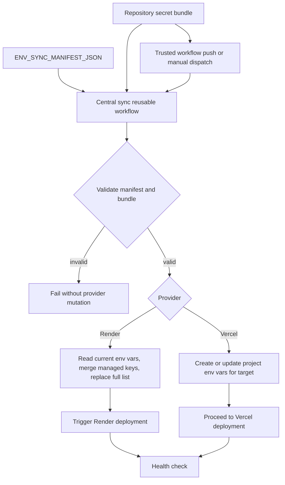

# Environment Secret Synchronization Design

**Date:** 2026-08-10
**Status:** Approved for specification review
**Scope:** Central reusable workflows and product repository deployment callers

## Goal

Allow product owners to enter runtime environment values into GitHub Repository Secrets without exposing those values to the workflow maintainers. A central reusable workflow will synchronize the values into the correct Render service or Vercel project for the correct deployment environment.

The product repository remains the configuration boundary for its own values. The central repository owns the synchronization implementation, validation, provider API adapters, and logging rules.

## Approved operating model

Use a phased hybrid model:

1. Provide a manual `Sync environment secrets` workflow with validation and dry-run support.
2. Run the same synchronization as a pre-deployment job for trusted pushes to `staging` and `prod`.
3. Never synchronize secrets from pull-request code or feature branches.
4. Production synchronization occurs only after the `staging` to `prod` promotion pull request has been merged and the resulting `prod` workflow is running.
5. A manual production sync must target the `prod` branch and use the same exact-commit production promotion guard as deployment.

Secret synchronization is separate from CI. Pull requests validate workflow configuration and application code but do not contact Render or Vercel with runtime secrets.

## Important GitHub Actions constraint

The manifest may describe which secret bundle belongs to which destination, but a reusable workflow must still receive the secret explicitly or through `secrets: inherit`. GitHub Actions does not provide a safe wildcard lookup such as “read whichever secret name appears in this variable.”

Do not serialize the entire `secrets` context with `toJSON(secrets)` to simulate dynamic lookup. That would give a synchronization step access to every repository secret and would weaken least-privilege isolation.

The recommended implementation therefore uses two fixed repository secrets per product repository:

```text
ENV_SYNC_STAGING
ENV_SYNC_PRODUCTION
```

Each bundle contains the managed environment values for that repository, grouped by logical target. The manifest describes the target and provider without containing any values.

## Configuration model

### Repository Secrets

The actual values are stored in GitHub Repository Secrets. Example `ENV_SYNC_STAGING` value:

```json
{
  "render-api": {
    "DATABASE_URL": "<value>",
    "JWT_SECRET": "<value>"
  },
  "vercel-frontend": {
    "NEXT_PUBLIC_API_BASE_URL": "<value>",
    "NEXT_PUBLIC_APP_NAME": "<value>"
  }
}
```

The production bundle has the same shape but contains production values. Values are never committed, placed in repository variables, included in workflow inputs, or printed in logs.

The bundle size must remain below GitHub's repository-secret limit. If a product exceeds that limit, its configuration must be split into multiple explicitly named bundles rather than silently truncating values.

### Repository Variables

The repository variable `ENV_SYNC_MANIFEST_JSON` describes destinations and managed keys:

```json
{
  "version": 1,
  "targets": [
    {
      "name": "render-api",
      "provider": "render",
      "environment": "staging",
      "service_id_var": "FRONT_AND_BACK_RENDER_API_SERVICE_ID",
      "bundle_key": "render-api",
      "secret_names": ["DATABASE_URL", "JWT_SECRET"]
    },
    {
      "name": "vercel-frontend",
      "provider": "vercel",
      "environment": "preview",
      "project_id_var": "FRONT_AND_BACK_VERCEL_PROJECT_ID",
      "bundle_key": "vercel-frontend",
      "secret_names": [
        "NEXT_PUBLIC_API_BASE_URL",
        "NEXT_PUBLIC_APP_NAME"
      ]
    }
  ]
}
```

`secret_names` is an allowlist and validation contract. The values remain in the bundle secret. The workflow must fail when a manifest key is missing from the bundle, when an unexpected managed key is present if strict mode is enabled, or when a target references a missing service/project variable.

For Vercel, the current central deployment workflow maps CICG `staging` to Vercel `preview` and CICG `prod` to Vercel `production`. The manifest must use the provider's actual target name, not assume that the CICG branch name is a Vercel environment name.

### Provider credentials

The product repository provides only the minimum provider credentials needed by the sync job:

```text
RENDER_API_KEY   # required for Render targets
VERCEL_TOKEN     # required for Vercel targets
```

The existing Vercel organization ID and project IDs remain configuration variables or existing deployment inputs. Render service IDs are repository variables. Existing Render deploy hooks remain responsible for triggering the image deployment unless the provider adapter explicitly replaces that behavior.

## Synchronization flow



The synchronization job must complete before the associated deployment job begins. A failed sync blocks deployment.

### Manual workflow

The manual workflow accepts:

- `environment`: `staging` or `production`.
- `dry_run`: default `true` for the first implementation and safe validation runs.
- `target`: optional logical target; empty means all targets for the selected environment.

Dry-run output may include target names, provider names, environment names, and key names. It must not include values, provider tokens, service URLs containing credentials, request bodies, authorization headers, or deploy-hook URLs.

### Automatic workflow

The deployment caller runs synchronization as the first deployment job:

```text
trusted push -> sync selected environment -> deploy backend -> health check -> deploy frontend -> smoke check
```

The sync job does not run on `pull_request`, on arbitrary feature branches, or for ordinary CI-only workflows. A change to a GitHub secret without an application commit can still be applied through the manual workflow.

## Provider adapters

### Render

Render environment-variable updates require the Render API, not only a deploy hook. The Render update endpoint replaces the complete environment-variable list and does not deploy automatically.

The adapter must:

1. Resolve the service ID from the repository variable named by the manifest.
2. Read the service's current environment variables.
3. Preserve unmanaged existing variables.
4. Replace only the manifest-managed keys with values from the bundle.
5. Submit the complete merged list.
6. Trigger the existing environment-specific deployment mechanism.
7. Wait for the health check before dependent deployment continues.

The adapter must not send only the managed subset to Render, because omitted variables would be removed.

### Vercel

The adapter uses `VERCEL_TOKEN`, the Vercel organization/team ID, and the project ID resolved from the manifest. It must create missing variables and update existing variables for the selected Vercel target.

For CICG staging, the provider target is normally Vercel `preview`. For CICG production, the provider target is Vercel `production`.

The adapter must mark sensitive values as sensitive where the Vercel API supports that setting. It must not retrieve or print decrypted existing values. After an update, the Vercel deployment must run because environment-variable changes apply to new deployments rather than already-created deployments.

Anything prefixed `NEXT_PUBLIC_` is intentionally exposed to the browser and must not contain a credential, private token, database URL, or other confidential value.

## Security boundaries

- Sync only runs from trusted `staging` and `prod` pushes or an explicitly dispatched workflow.
- Pull requests do not receive provider credentials or runtime secret bundles.
- The central workflow is referenced by an immutable release tag or commit SHA.
- The sync job has only the permissions needed to read repository contents and use the provider API credentials.
- No secret values are written to artifacts, summaries, PR bodies, cache entries, or `GITHUB_OUTPUT`.
- Logs may show provider, target, environment, and key names only.
- Failure messages must be generic enough not to reveal secret values or provider response bodies containing them.
- Production synchronization retains the exact merged-promotion SHA guard.

## Failure and rollback behavior

Validation happens before any provider mutation. If validation fails, the workflow stops without changing Render or Vercel.

If a provider update partially succeeds, the workflow reports the target and operation stage without displaying values. The next run must be idempotent and converge the provider to the bundle's managed values.

Secret synchronization is not itself a rollback of application code. Rollback workflows must redeploy a known-good application revision while retaining the selected environment's current secret values unless the operator explicitly runs a secret sync with a previous bundle.

## Testing strategy

The central repository must add tests for:

1. Manifest schema validation.
2. Missing bundle key detection.
3. Unexpected-key handling in strict and non-strict modes.
4. Provider/environment validation.
5. Render merge behavior preserving unmanaged keys.
6. Render request construction without logging values.
7. Vercel create/update selection without logging values.
8. Dry-run behavior proving that no provider mutation is attempted.
9. Production branch and exact promotion guard behavior.
10. Secret-shaped values containing quotes, newlines, Unicode, and shell metacharacters.

Product repositories must add caller validation proving that their manifest, bundle names, service IDs, project IDs, and existing deploy configuration agree.

The first rollout should use a dry run on one product, followed by a staging synchronization and health check. Production synchronization should be enabled only after the staging result is verified.

## Non-goals

- Discovering or exporting all GitHub Repository Secrets dynamically.
- Replacing GitHub's secret storage with a new vault in this change.
- Copying secrets between repositories.
- Reading secret values back from Render or Vercel.
- Automatically deleting every provider variable not managed by the manifest.
- Running synchronization from untrusted pull requests.
- Changing the existing branch promotion model.

## Acceptance criteria

The design is implemented successfully when:

- A product owner can update a repository secret bundle without exposing its values to the workflow maintainers.
- A validated manifest maps each managed key to a Render service or Vercel project and provider environment.
- Manual dry-run validation identifies missing or unexpected keys without mutating providers.
- A trusted staging deployment synchronizes secrets before deployment and blocks deployment on sync failure.
- A merged production promotion synchronizes production secrets before production deployment.
- Render updates preserve unmanaged variables and explicitly trigger deployment afterward.
- Vercel updates target the correct `preview` or `production` environment and are followed by a new deployment.
- Logs, artifacts, summaries, and pull requests contain no secret values.
- Secret synchronization is never executed for pull-request code.
- Tests cover parsing, provider request behavior, idempotence, and redaction-sensitive values.
